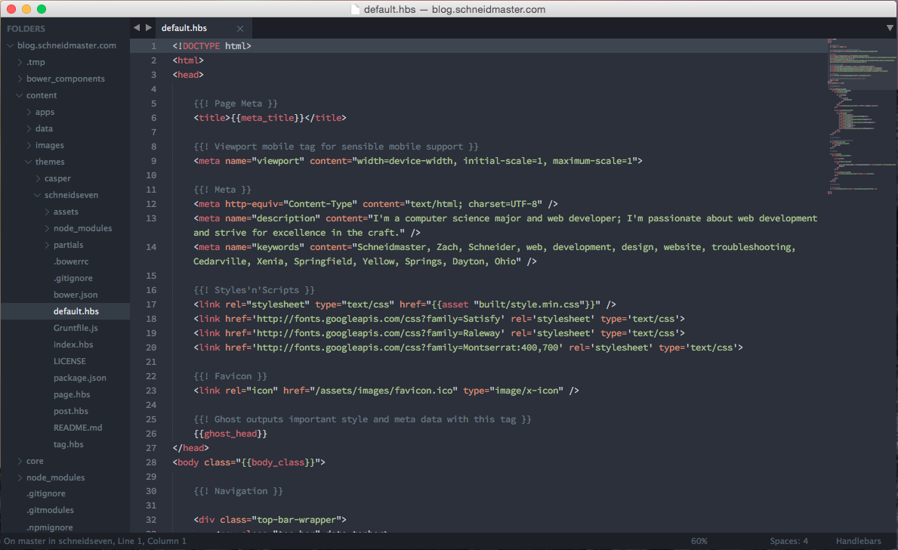

Now that I've been using Sublime Text full-time for a few months, I decided to put together a short post detailing my Sublime Text setup.  Since converting from Coda 2 in the spring, Sublime Text has become my most indispensable development tool- I love its lightning-fast speed and infinitely extensible API.

Sublime Text currently has two versions: the older, stable Sublime Text 2 and the newer Sublime Text 3 which is in public beta.  I've been using ST3 for a few months now; it offers a dramatic speed boost as well as a few new features.  All of these plugins are ST3 compatible and all are installable via [Package Control](https://sublime.wbond.net/) unless otherwise noted.

### Appearance
- Theme: [Nil](https://github.com/nilium/st2-nil-theme) - Flat, minimalist Sublime theme.  By default, its folder labels are an ugly (IMO) purple color, but you can make them white by adding the following lines to your user preferences:

```json
"disable_colored_folder_labels": true,
"disable_colored_group_labels": true,
```

- Color Scheme: [LastNight](https://github.com/daylerees/colour-schemes), a color scheme in the Dayle Rees Color Scheme package
- Font: [Adobe Source Code Pro](http://sourceforge.net/projects/sourcecodepro.adobe/files/), a very nice font for displaying code.  After installing the font, you can set it as the display font in Sublime Text by adding the following line to your user preferences:

```json
"font_face": "Source Code Pro",
```
    
All together, my setup looks like this:



### Code Formatting

Plugins that let you easily format various types of code.

- [BeautifyRuby](https://github.com/CraigWilliams/BeautifyRuby)- Plugin to format your Ruby code.  Configurable to format when you run it manually or when you save a \*.rb file.  This plugin doesn't seem to work by default out of PackageControl- to avoid getting errors, follow [these instructions](http://jonastebbe.ghost.io/getting-started-with-rails-and-sublime-text-3/#beautifyruby) to configure it correctly.

- [JSFormat](https://github.com/jdc0589/JsFormat) - Plugin to format your JavaScript code.  Also configurable to run manually or automatically on save.

- [SassBeautify](https://github.com/badsyntax/SassBeautify/) - Plugin to format your SASS code.

- [ScalaFormat](https://github.com/timonwong/ScalaFormat/) - Plugin to format your Scala code.

### Functionality

Plugins that extend the basic functionality of Sublime Text.

- [Sublime SFTP](http://wbond.net/sublime_packages/sftp) - SFTP client/plugin for Sublime Text.  Supports remote server browsing, save on upload, sync up/down, and more.  Free to try; $20 for a license.

- [SublimeGit](https://sublimegit.net/) - Integrates a number of Git features smoothly into Sublime Text: diffs, status, commits, etc.  Free to try; €10 (~$14) for a license.

- [SyncedSidebar](https://github.com/sobstel/SyncedSideBar) - Small plugin that keeps the sidebar position (open folders, scrolling, etc.) in sync with the currently open file.

- [WakaTime](https://www.wakati.me/) - One of my favorite plugins.  Automatically keeps track of your coding time on each project and stores/reports it via the website and (optionally) a weekly summary email.  Very useful for time tracking/billing purposes, especially for freelancers.

### Syntax Highlighting

Sublime Text includes highlighting for a number of different languages out of the box, but I've found a few additional syntax highlighting packages to be useful for specific frameworks and templates.  Depending on which frameworks you spend your time in, your mileage may vary.

- [Better Coffeescript](https://github.com/aponxi/sublime-better-coffeescript/) - Provides syntax highlighting for Coffeescript files, as well as a few extra features like automatic compilation.

- [Handlebars](https://github.com/daaain/Handlebars) - Syntax highlighting and shortcuts for Handlebars.js templates.

- [Java Velocity](https://github.com/jampow/velocity-sublime) - Syntax highlighting for Velocity templates, also useful for \*.ssp files in Scala.

- [jQuery](https://github.com/SublimeText/jQuery) - Syntax highlighting and autocompletion for jQuery functions.

- [Less](https://github.com/danro/LESS-sublime) - Syntax highlighting for Less.js files (a CSS extension language).

- [PHP-Twig](https://github.com/Anomareh/PHP-Twig.tmbundle) - Syntax highlighting for the Twig templating engine, used by default in Symfony2.

### Writing Code

- [DocBlockr](https://github.com/spadgos/sublime-jsdocs) - Plugin to simplify writing documentation comments in a number of languages.  Initiate a function comment with `/**` and `return`, and DocBlockr will open up and template out a documentation block for you.

- [Emmett](https://github.com/sergeche/emmet-sublime) - Very useful plugin that provides a number of shortcuts for writing HTML.  Drastically increases your HTML coding speed once you're used to the syntax. 
