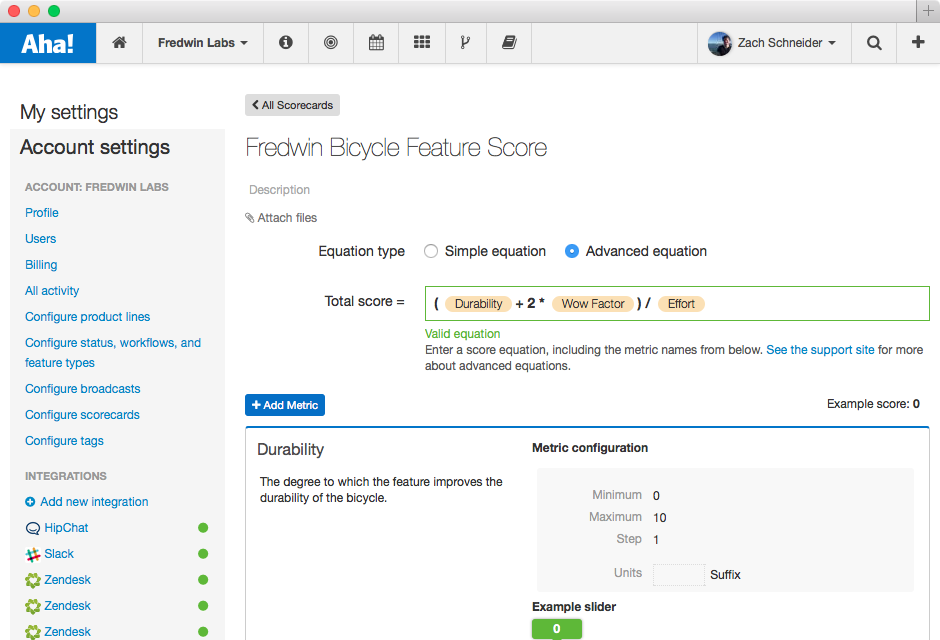

I love this team. I love the product and engineering team at [Aha!](http://www.aha.io) because we believe in objectively prioritizing work. To truly build what matters, you must identify which feature requests will help you achieve your goal and which ones will waste your time. Most ideas sound great but actually matter little.

The challenge for all product developments teams is humans.

The human factor involved in leading product complicates decision making. People develop their own pet projects, and it becomes tougher to prioritize without stepping on toes.

To alleviate this problem, we developed the [Aha! Score](http://blog.aha.io/index.php/better-feature-prioritization-with-advanced-aha-scores/) — a means of removing some of the subjectivity from feature prioritization. The Aha! Score allows product managers to develop a formula for scoring their feature and then use sliders to score each metric for each feature. The resulting score introduces high-level business value and removes some of the subjective, human component from the prioritization process.

To make scorecards as useful as possible, we wanted to support arbitrarily complex formulas. This ensures that our technical implementation is never a constraint on customer success. We also wanted to develop a rich editing experience for managers to use when defining and testing their formulas.

In addition, we wanted to ensure that calculated results are always technically and mathematically accurate. To solve these problems, we developed two core components which we later open-sourced as gems: [token-text-area](https://github.com/k1w1/token-text-area) and [eqn](https://github.com/schneidmaster/eqn).

#### token-text-area

The first gem, token-text-area, is focused around the rich editing experience. This is where the title of this post comes into play: we wanted a way for users to insert metrics and mathematical symbols and numbers into the same equation, while still making it clear which components belong where. To solve the problem, we used a contenteditable div as the equation field, allowing it to contain both “tokens” (spans representing a particular metric) and numbers/math symbols.

As you can see in the screenshot, this allows for a rich editing experience in which the user can quickly develop complex formulas based on how each metric affects their business process. To insert the tokens, we provided autocomplete support. The user simply has to begin typing the name of a metric; once they do, a popup menu suggests tokens to insert.

The hardest part of this implementation step was developing consistent cross-browser behavior in contenteditable divs. For example, Chrome will not blink the cursor in a contenteditable div that is focused but does not contain any text, while Internet Explorer displays odd behavior with mouse click bindings.

We decided to [open source](https://github.com/k1w1/token-text-area) our solution to smooth the path for others solving similar problems in the future.

#### eqn

Finally, we had to develop a means of calculating equation results (including metrics, numbers, and basic functions) while respecting order of operations. We rejected use of Ruby’s eval for security reasons; users could theoretically enter arbitrary text into the equation field, and proper sanitization is a tough problem with many corner cases.

We developed our own mathematical parser using the [Treetop](http://treetop.rubyforge.org/) parser generator; the result was the [eqn](https://github.com/schneidmaster/eqn) gem. We selected a parser generator for its stability and predictability; trying to roll your own lexer/parser solution typically results in many corner cases and difficult-to-trace bugs. As an added benefit, the generator rejects anything outside of the explicitly defined grammar, and doesn’t require us to make use of eval; malformed equations simply throw an easily handled exception.

At Aha! we do our best to help our customers prioritize their features and focus on building what will have the biggest impact. Equally, we believe in giving back to the developer community through open-sourcing components of our code.

We are always hiring exceptional Rails and CoffeeScript engineers; check out our [careers](http://www.aha.io/company/careers) page if you’re interested in joining a fast-growing company that continues to stretch the limits of what technology can do.

*This post was originally published on the [Aha! blog](http://blog.aha.io/index.php/making-magic-with-contenteditabletrue/).*
