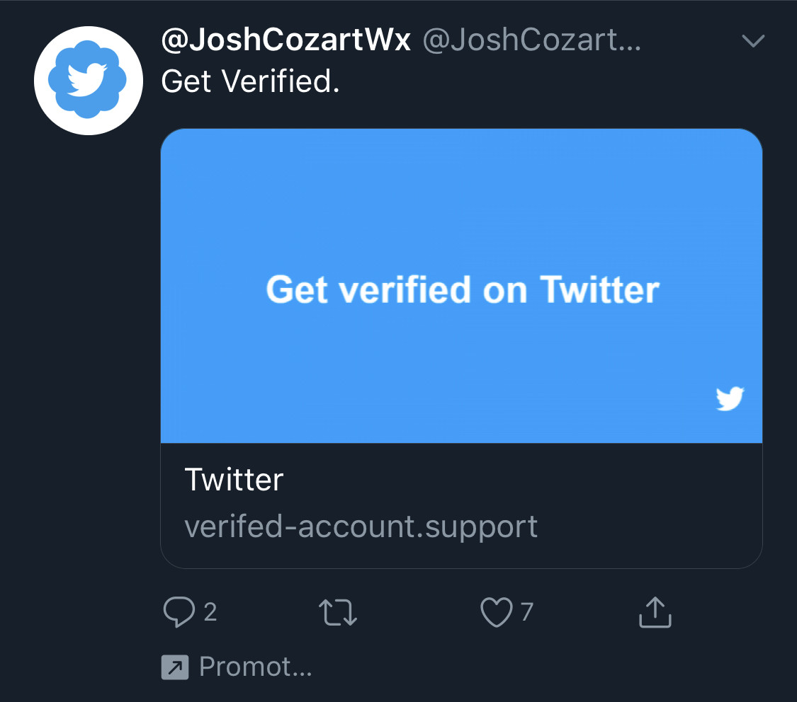
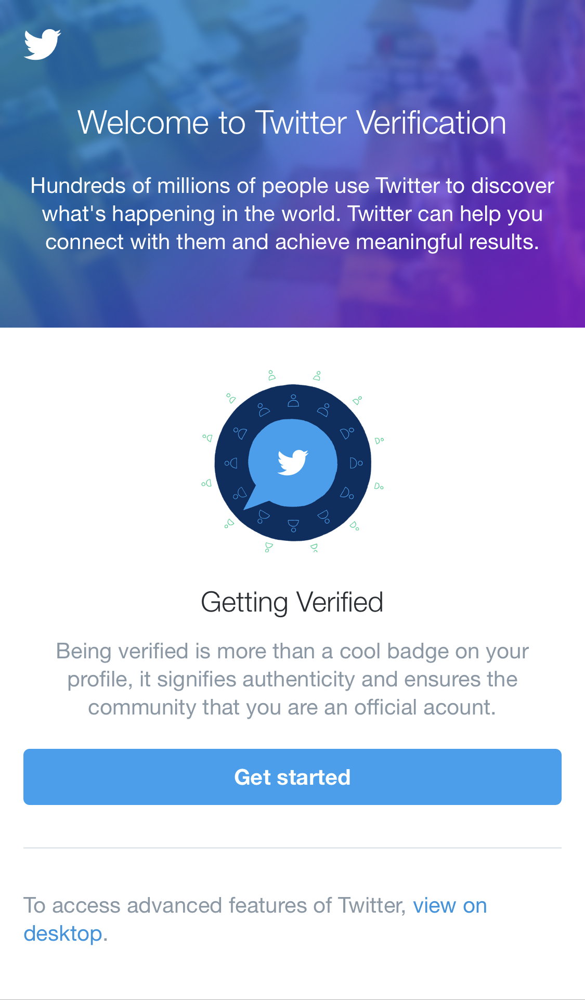
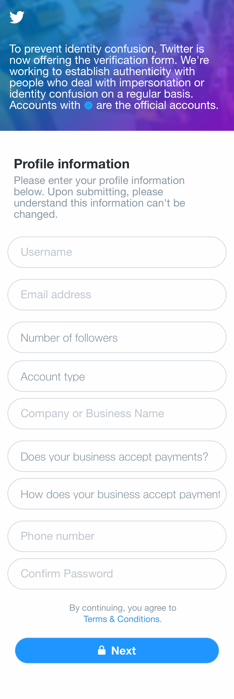
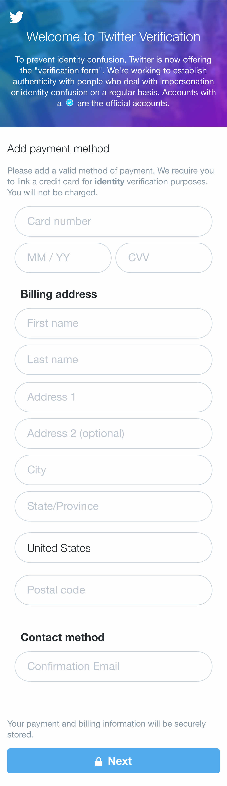
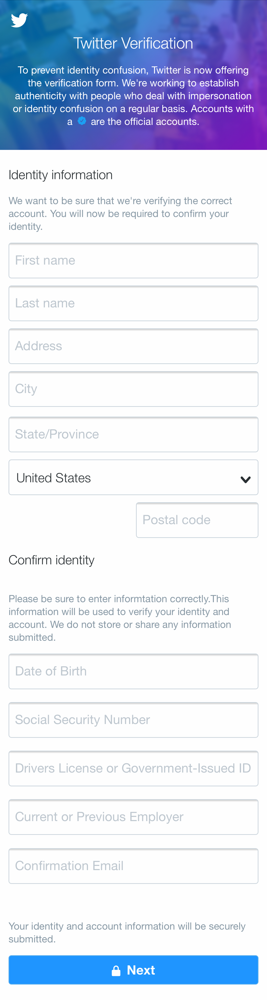
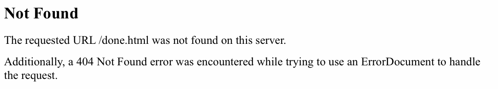

I was scrolling through my Twitter feed today and came across a curious-looking ad:



Hmm. Last I checked, Twitter doesn't use random accounts to advertise verification -- and in fact, they [haven't accepted verification requests](https://twitter.com/verified/status/968243242184491008) from the public for over a year now. Curious, though -- I wonder what the phishers want. Let's find out...



Upon first clicking the link, you're taken to a fairly realistic-looking landing page. It's a pretty good fake -- the look and design definitely feel like Twitter help content. The URL is wrong, of course, but it's a domain that could pretty easily fool someone nontechnical: `verifed-account.support`.

Let's get started and see what they ask for.



Alright, now some cracks are showing -- the copy at the top is definitely awkward. I'm given a form asking for my name, email, some details like follower count, aaaaand please just confirm my password. I'm sure that if I entered my own account info, my account would also soon be purchasing ads letting people know how to get verified.

Incidentally, the "Terms & Conditions" link goes to `file:///C:/Users/Serio/Documents/February%202019%20Donation%20Site/index.html`. Seems like the creator of this site left an accidental calling card.

Let's see what's next...



Saucy. They also want my credit card -- just for identity verification, of course. I wonder if the phishers use stolen credit cards to buy more phishing ads.

Moving on...



What the hell, if I already gave them my password and credit card number, they may as well grab my SSN and all the other information they'd need to start opening credit accounts in my name. Needless to say, Twitter would never legitimately ask for any of this information.

Let's see what's next...



Awww. They forgot to implement a confirmation page. I guess if I've gotten this far, they already have everything they want from me.

The phishing website's code is not all that interesting, sadly. Just HTML and some PHP to store the form data. It actually hotlinks its CSS directly from Twitter (`twimg.com`, which is the host that Twitter.com uses for most of its assets). I suspect a lot of the HTML is ripped from a Twitter property as well -- there's a lot of leftover tags that seem odd. For example, the state dropdown in the identity form has option tags like this:

```html
<option value="US" data-termsurl="https://ads.twitter.com/terms/us" data-valid="true" data-vat="false">United States</option>
```

So that explains why it looks so familiar. I can't figure out where it's from exactly, but I'm sure the HTML/CSS is from an old Twitter help site or something.

### Stay safe out there

For an audience of developers, I'm sure I'm preaching to the crowd -- but for anyone who's not a developer, or who even just wants a refresher, there are several red flags that mark this as a phishing attack.

1. **The source** -- Put simply, does it make sense? Do companies typically communicate this way? In this case, the source is a tweet from the account [@JoshCozartWx](https://twitter.com/JoshCozartWx), who appears to be a meteorologist from Illinois. (His account probably got hacked as well, or maybe he was the last person to fall for the scam.) Obviously, Twitter does not disseminate official communications about its verification program via the accounts of small-time meteorologists.

2. **The domain** -- Virtually every phishing attack uses a domain that is convincingly similar in some way, but is not the official domain of the company or website. In this case, the domain is `verifed-account.support` -- obviously, not `twitter.com`. In part, this attack takes advantage of the general public's relative unfamiliarity with the recent proliferation of top-level domain names -- there were no `.support` domains before 2014. Other attacks in this genre will use the correct domain as a subdomain of a different domain -- something like `support.twitter.com.twitter-support.com` (where `twitter-support.com` is owned by the attacker). It's important to remember that the last section of the domain (the `twitter-support.com`) is the piece that controls where your request goes; the rest can be trivially set up as whatever the attacker wants it to be.

3. **The grammar** -- For whatever reason, almost every phishing attack has grammatical and spelling errors, or at minimum has text content that just doesn't sound right. In our case, the domain itself has a typo (`verifed`) -- this is a common hallmark of phishing attacks which rely on you not noticing the subtle misspelling. The content at the top of the form sounds a little off -- "Accounts with [check icon] are the official accounts", for example; "the official accounts" part is weirdly phrased. There's also a typo ("informtation") on the "Identity information" form (though if you've gotten there, you're already in trouble). This particular attack was pretty good about avoiding egregious spelling and grammatical errors, but in general, they are often a sign that you're in the wrong place.

4. **The ask** -- Is the website asking you for something that just doesn't make sense? There are a few of those here -- for starters, why is Twitter asking me for my follower count, as if they don't already know? Obviously, the website is also asking for information that Twitter would never ask for -- credit card and social security number stand out in this category. Even if the website is legitimate, be judicious about what information you give out on the Internet. At best, you're trusting a well-meaning entity to keep your information safe, and at worst, you're giving it away to an attacker.
