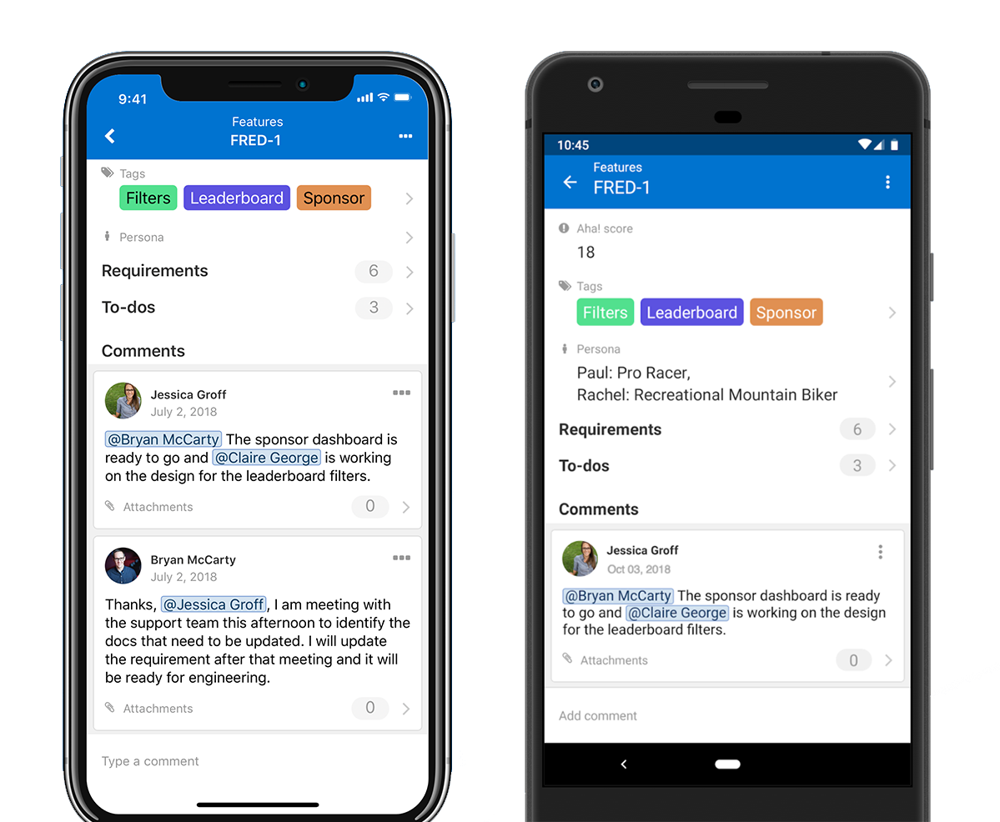

It's been an up-and-down kind of year for React Native. Last summer, [Udacity](https://engineering.udacity.com/react-native-a-retrospective-from-the-mobile-engineering-team-at-udacity-89975d6a8102) and [Airbnb](https://medium.com/airbnb-engineering/sunsetting-react-native-1868ba28e30a) announced that they were moving off of the platform; [Discord](https://blog.discordapp.com/why-discord-is-sticking-with-react-native-ccc34be0d427) is sticking with React Native but still publicized a number of issues they experienced, and their Android app does not use React Native at all. Facebook has [recommitted](http://facebook.github.io/react-native/blog/2018/06/14/state-of-react-native-2018) to supporting the platform and published an [open source roadmap](https://facebook.github.io/react-native/blog/2018/11/01/oss-roadmap), but many engineers remain skeptical of React Native's future.

Amidst the FUD, I think it's important to keep a balanced perspective. Every framework has its drawbacks, but React Native is still an enormous improvement upon any hybrid mobile framework that came before it. For us at Aha!, React Native was a godsend. We used it to build and release our mobile applications for both [iOS](https://itunes.apple.com/us/app/aha/id1378433025?mt=8) and [Android](https://play.google.com/store/apps/details?id=io.aha.mobile). We had an excellent experience using the framework and have no regrets about our technology choice. I'm writing this post particularly to document some of the benefits we found, and why React Native was a perfect fit for our use case.

### Truly feels native

It's easy to overlook this, but React Native is the first framework that seems to come anywhere close to delivering on the promise of hybrid apps that actually feel native to each platform. React code is rendered to native UI components implemented with Objective-C and Java. This makes it easy to use device-specific design language and follow the Apple/Android interface guidelines while also delivering native-quality application performance. We found very few of the problems common among hybrid mobile frameworks -- interactions and animations are buttery smooth, and the app is snappy and just plain satisfying to use.

### Two apps from one codebase

Again, React Native finally delivers a benefit that was promised but never fully realized by past hybrid frameworks. You can write your code once, in JavaScript, and seamlessly render it to multiple platforms. Only a small handful of components in our codebase are specific to one platform, and that's only in areas where we truly wanted a different experience with iOS- and Android-specific logic. For our other components, we found it simple to tailor details of the user interface for each platform using conditional styling -- like using different icons to match the common design language of both environments, or centering the navigation on iOS while left-aligning it on Android.

### Leverage existing developer knowledge

Aha! is first and foremost a web application; we did not offer a mobile app for the first five years of the product's existence. As such, we didn't (and still don't) have any dedicated mobile engineers on our team. We did, however, have plenty of React experience, as we've used React for several years to build rich, client-side user experiences for our web application. React Native allowed us to seamlessly leverage that existing knowledge to build a mobile app that our entire team could quickly grok and contribute to as needed. The code patterns are very similar to React on the web -- we use redux with sagas for data storage and mutation, and jest/enzyme for testing. The only real differences are the parts that are truly specific to mobile, such as navigation and device-specific styling. This was a tremendous boon for us because it significantly lowered the barrier to entry. We were able to build and launch our applications without having to hire a mobile-specific engineering team.

### Build and ship really, really fast

Along with React Native, we used [Expo](https://expo.io/) to streamline our development process even further. Expo smooths over a number of pain points in the mobile development process. It allows you to run your app on your device by starting up Expo on your computer and then opening the Expo client app. Let that sink in: we developed an entire production application for iOS without once opening Xcode! Expo also offers a build service which abstracts away the complexity of certificate management and other nuances of building a mobile app for the store. Finally, Expo provides over-the-air app updates out of the box. We are able to implement and push out changes to our JavaScript code without having to submit a full build to the app stores for each change, which is normally an excruciating process. This has been particularly helpful for quickly turning around bug fixes, which we can ship to our users in a matter of minutes rather than days.

### Secret to success

Our secret sauce is React Native. The framework gave us an incredible amount of leverage to build and maintain mobile applications with knowledge that we already had from working with React on the web. React Native delivers on the promises that hybrid apps have made for years -- our mobile apps feel smooth and satisfying, and they are virtually indistinguishable from fully native apps. We were able to seamlessly build for both iOS and Android off of a single codebase, tailoring details of the user interface to match the design language and patterns of each platform. The tooling greatly boosted our productivity, allowing us to quickly iterate in development and ship out fixes in a matter of minutes. We have no regrets about our decision, and I encourage you to give React Native a deeper look if your use case sounds like ours.

_Originally published on the [Aha! engineering blog](https://www.aha.io/engineering/articles/secret-sauce-react-native)._
