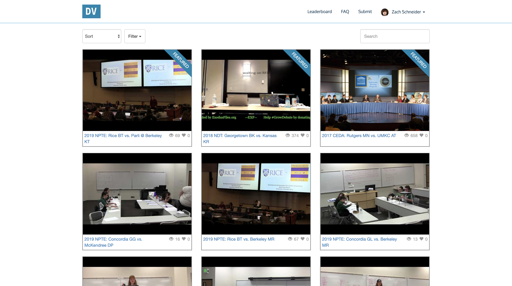
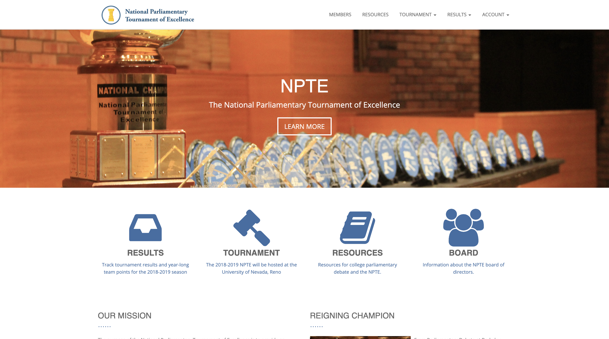
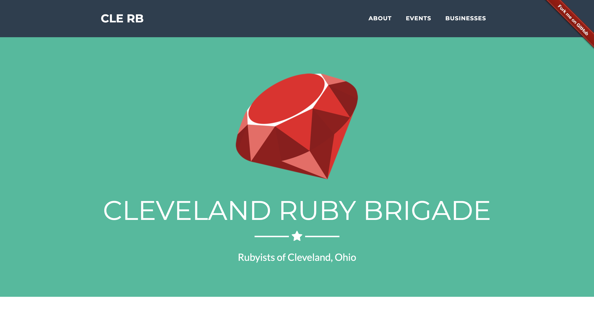
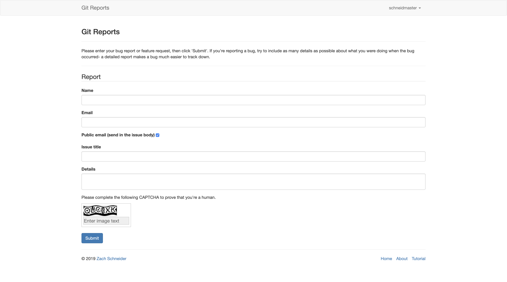
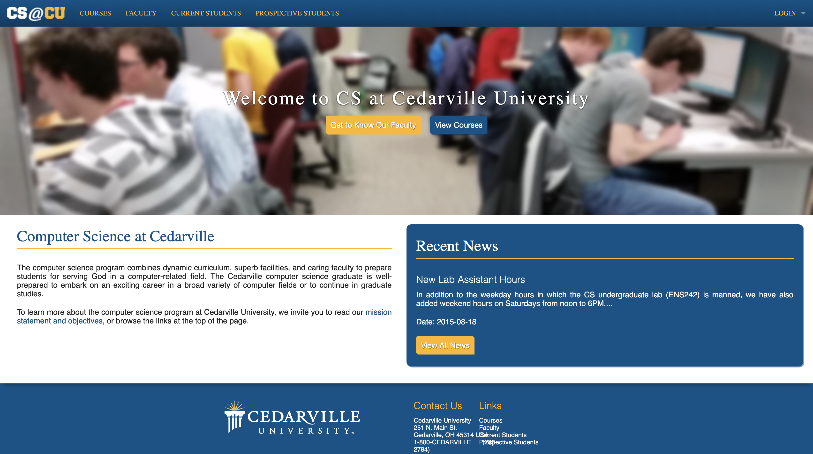

## Socializer

**Technologies**: Elixir, Phoenix, GraphQL, React, Apollo

**Source**: [GitHub](https://github.com/schneidmaster/socializer)

[Socializer](https://socializer-demo.herokuapp.com) is a toy social media application that I built to demonstrate Elixir + Phoenix + GraphQL + React + Apollo. Users can create posts or comments and chat with other users.

---

## DebateVid.io

**Technologies**: Ruby on Rails, React

**Source**: [GitHub](https://github.com/schneidmaster/debatevid.io)

[DebateVid.io](https://debatevid.io) is a centralized repository for parliamentary, policy, and Lincoln-Douglas debate videos. Users may log in via Facebook, Twitter, or Google, submit videos from Vimeo or YouTube, and add appropriate metadata about the schools and arguments featured in the video.

---

## NPDA

**Technologies**: Ruby on Rails, React

[Website](https://www.parlidebate.org) for the National Parliamentary Debate Association. Includes a backend for points entry, admin system for site management, CMS for static content, member fees payments via PayPal, and general information about the organization.

---

## NPTE

**Technologies**: Ruby on Rails, React

[Website](https://www.nptedebate.org) for the National Parliamentary Tournament of Excellence. Includes a backend for tournament results entry and rankings calculation, public-facing tables of results by year/team/tournament, and general information about the organization.

---

## Cleveland Ruby Brigade

**Technologies**: Ruby on Rails

**Source**: [GitHub](https://github.com/clerb/clerb-rails)

[Website](https://www.clevelandrb.com) for the Cleveland Ruby Brigade, a Cleveland-area ruby meetup that I help organize.

---

## Cleveland React

**Technologies**: React, Gatsby

**Source**: [GitHub](https://github.com/clereact/clereact)

[Website](https://clereact.dev) for Cleveland React, a Cleveland-area React meetup that I co-founded.

---

## Git Reports

**Technologies**: Ruby on Rails

**Source**: [GitHub](https://github.com/schneidmaster/gitreports.com)

[Git Reports](https://gitreports.com) is a free service that allows developers to set up a stable URL for anonymous users to report bugs which are then created as issues on a public or private GitHub repository.

---

## cs.cedarville.edu

**Technologies**: Ruby on Rails

[Website](http://cs.cedarville.edu) for the Computer Science Department at Cedarville University. Includes comprehensive backend course management features for CS professors to create class schedules, manage course files, etc. Completed for my senior design project in 2013-2014.

---

## Cedarville Out

**Technologies**: Jekyll

[Website](https://cedarvilleout.org) for Cedarville Out, an organization of lesbian, gay, bisexual, trans\*, queer (LGBTQ) and other sex- and gender-nonconforming students and alumni of Cedarville University. Built with Jekyll atop the [Drava](http://themeforest.net/item/drava-multipurpose-theme-powered-by-jekyll/11383647) theme.
